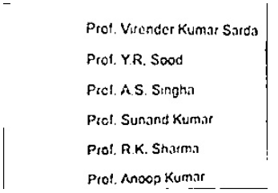

# Text-to-braille
converts the written text into braille system using Arduino uno.

Basic Function -->

The given code majorly focus on the image pre-processing part,
the code tries to convert the captured image into a scanned image,
this scanned image will be one dimantional, i.e. purely black or white.

After the conversion of the captured image into a provessed image,
it is fed to a pre trained model which is capable of predicting the printed english alphabets. 

After the prediction part is done, the pridicted data will be stored in a word file.
And then the string of alphabets will be sent to the arduino through sirial communication port 22.

Now, we have previously coded Arduino and which will move the servo-motors according to the brail system(6 pointed brail system only).
No, special characters are included in the brail code yet, but the arduino code will be enhanced in future.

Example output image after processing from the camera input and before sending to the model for prediction:

